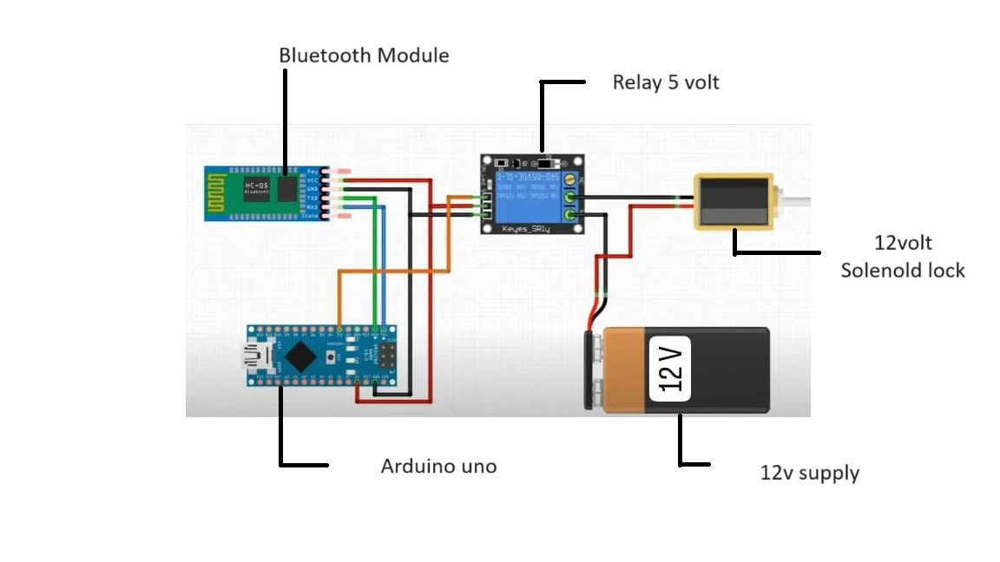
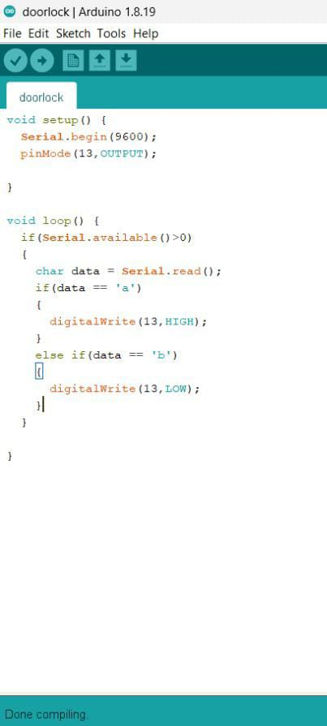
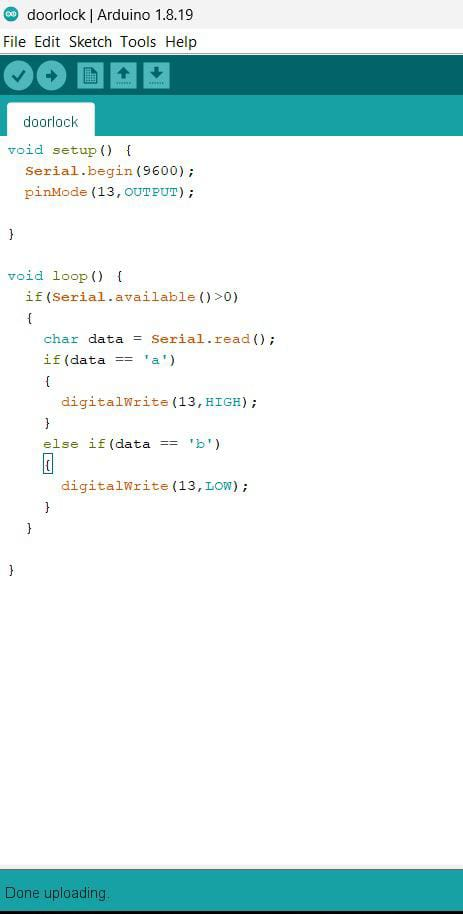

# Smart-Door-Lock-with-Bluetooth
Built using Embedded and IOT

## Overview
A smart door lock system that allows users to remotely lock/unlock a door via a mobile device. The project uses an Arduino Uno, a 12V solenoid lock, a 5V relay, and a Bluetooth module for wireless communication. The Arduino processes mobile commands and controls the relay to actuate the lock, ensuring secure access

## Technologies Used
- **Tools:** Arduino IDE .
  
# Screenshots of the Project

## video

  

